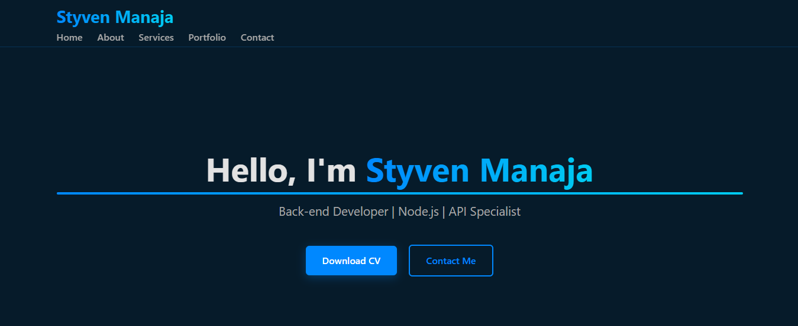

# 💼 Personal Portfolio - Node.js & Express

Welcome to my personal portfolio built with **Node.js** and **Express.js**. This project aims to showcase my profile, skills, and projects through a clean, fast, and responsive interface.

---

## 🚀 Features

- ⚡ Lightweight Node.js server using Express
- 🌐 Multi-page navigation: Home, About, Services, Portfolio, Contact
- 🎨 Custom CSS integration
- ❌ Styled 404 page for non-existent routes
- 📁 Clean architecture with separation of views and static assets

---

## 📂 Project Structure

```
styven-manaja/
│
├── public/                 # Static files (CSS, images, JS)
│   ├── css/
│   │   └── style.css
│   ├── assets
│   │   └── cv/
│   │        └── styven-manaja-CV.pdf
│   │   └── img/
│   │        └── image.png
│   └── script
│       └── main.js
│
├── views/                 # HTML pages (static views)
│   ├── index.html
│   ├── about.html
│   ├── services.html
│   ├── portfolio.html
│   ├── contact.html
│   └── 404.html
│
├── src/                   # JavaScript files (code structure)
│   ├── controllers/
│   │   └── controller.js
│   ├── routes/
│   │   └── route.js
│   └── services/
│       └── service.js
│
├── app.js                 # Main Node/Express app file
├── server.js              # Server file
└── package.json           # Dependencies and project info
```

---

## 🛠️ Technologies Used

- [Node.js](https://nodejs.org/)
- [Express.js](https://expressjs.com/)
- HTML5 / CSS3

---

## ▶️ Run the Project Locally

```bash
# 1. Clone the repo
git clone https://github.com/StyvenManaja/styven-manaja.git

# 2. Navigate into the project directory
cd styven-manaja

# 3. Install dependencies
npm install express, cors, dotenv, helmet, morgan, nodemailer, morgan

# 4. Start the server
npm run dev
```

Then open your browser and go to:  
📍 `http://localhost:8080`

---

## 🌐 Available Routes

| Route             | Description             |
|------------------|-------------------------|
| `/`              | Home page               |
| `/about`         | About me                |
| `/services`      | Services page           |
| `/portfolio`     | Portfolio page          |
| `/contact`       | Contact page            |
| `*`              | Custom 404 page         |

---

## 📸 Preview
  


---


## 👤 Author

**Styven Manaja** – *Javascript backend developer & web enthusiast*  
📧 Contact: [ranaivoson.manaja@gmail.com](mailto:ranaivoson.manaja@gmail.com)

---

## 📄 License

This project is open-source and licensed under the MIT License.